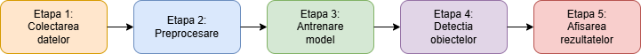

# Detectarea Dronelor

Proiect PI realizat de Pînzaru Silviu și Andone Vlad Andrei

## Tabelul literaturii de specialitate studiate

| Nr | Autori | Anul publicării | Titlul articolului | Domeniul | Tehnologii utilizate | Metodologie | Rezultate | Limitări | Comentarii |
| -- | ------ | --------------- | ------------------ | -------- | -------------------- | ----------- | --------- | -------- | ---------- |
| 1 | Ivan Garvanov, Magdalena Garvanova, Vladimir Ivanov, Denis Chikurtev, Ava Chikurteva | 2024 | Drone Detection Based on Image Processing [1] | Detectia UAV-urilor | MATLAB, YOLO | Detectarea obiectelor se realizează folosind o fereastră glisantă de diferite dimensiuni pentru a detecta obiecte de diferite dimensiuni. | Rata de detectie ~89% | La distante mai mari detectia este mai slaba | Se poate imbunatati detectia folosind si imagini in infrarosu
| 2 | Muhammad K. Kabir, Anika N. Binte Kabir, Jahid H. Rony, Jia Uddin | 2024 | Drone Detection from Video Streams Using Image Processing Techniques and YOLOv7 [2] | Modele pentru detectarea obiectelor | Tehnici de pre-procesare, YOLOv7/v8 | Utilizarea a 2 modele pre-antrenate pentru detectia de drone in videouri | 0.9673 mAP@0.5IoU si 0.9582 Scor-F1 | Set de date relativ mic | |
| 3 | Vedanshu Dewangan, Aditya Saxena, Rahul Thakur, Shrivishal Tripathi | 2023 | Application of Image Processing Techniques for UAV Detection Using Deep Learning and Distance-Wise Analysis [3] | Deep Learning in detectia obiectelor | YOLOv5/v7 | YOLO împarte imaginea de intrare într-o grilă S × S. Dacă centrul unui obiect se încadrează în interiorul unei celule a grilei, atunci acea celulă a grilei devine responsabilă pentru detectarea obiectului. | mAP = 96.7%(IoU = 0.5); mAP = 61.4%(IoU = 0.5:0.95) | Modelul YOLOv7 nu a reușit în mare parte să detecteze drona în medii dure sau in momente in care dronele erau prea mici in imagine.
| 4 | MD Imran Hosen; Sevcan Kahraman | 2025 | Deep Learning-Based Efficient Drone Detection and Tracking in Real-Time [4] | Detectia dronelor folosind deep-learning| DeepSORT | Framework-ul utilizat permite urmărirea dronelor în timp real prin integrarea unui detector eficient . | mAP = 92.1%(IoU = 0.5), precision = 91.6% | Viteza de interferenta este ceva mai scazuta(~44 FPS) comparativ cu alte modele populare(ETN - 49 FPS)
| 5 | Subroto Singha, Burchan Aydin | 2021 | Automated Drone Detection Using YOLOv4 [5] | Detectia dronelor folosind procesarea imaginilor | YOLOv4 | YOLOv4 urmează o arhitectură de detector cu o singură etapă, formată din patru părți: intrare, coloană vertebrală(bag of freebies (BoF), bag of specials (BoS), and CSPDarknet53), gât și predicție densă sau cap. |  mAP = 74.36%(IoU = 0.5); FPS = 19.0(DJI MAVIC Pro) & 20.5(DJI Phantom III) | Set de date destul de mic, modelul nu este suficient de antrenat
---
[1]: https://ieeexplore.ieee.org/abstract/document/10637850
[2]: https://www.mecs-press.org/ijigsp/ijigsp-v16-n2/IJIGSP-V16-N2-7.pdf
[3]: https://www.mdpi.com/2504-446X/7/3/174
[4]: https://ieeexplore.ieee.org/document/11111880
[5]: https://www.mdpi.com/2504-446X/5/3/95?trk=public_post-text
 

mAP
: Precizie medie (mean Averge Precision): Utilizat pentru a analiza performanța sistemelor de detectare și segmentare a obiectelor.

IoU
: Raport Intersectie-Uniune (Intersection over Union): Utilizat în viziunea computerizată pentru a evalua acuratețea detectării obiectelor

Scor F1
: Media armonică dintre precision și recall, utilizată pentru a evalua performanța modelelor de clasificare în învățarea automată.

## Etapele proiectului

1. **Colectarea datelor**
    – preluarea informatiilor cu de la cele 4 surse video în diferite condiții de iluminare și medii.

2. **Preprocesare**
    – redimensionare, filtrare și conversie în format compatibil YOLO.

3. **Antrenarea modelului**
    – antrenare model YOLOv8, folosind un dataset personalizat, antrenare pe 100 de epoci

4. **Detectia obiectelor**
    – rularea modelului antrenat pe videoclipuri si eliminarea detectiilor false

5. **Afișarea rezultatelor**
    – desenarea bounding box-urilor pe videoclipuri cu probabilitatea detecției.
